```mermaid {look: 'handDrawn', scale: 0.42}
flowchart LR
  sceneVp("🪟 Scene Viewport")
  pingVp("🪟 Ping Viewport<br/>✨ Blur Shader")
  pongVp("🪟 Pong Viewport<br/>✨ Blur Shader")
  screenVp("🖵 Screen Viewport")

  scene("🪾 Scene Root Node")
  pingSp("👻 Ping Sprite")
  pongSp("👻 Pong Sprite")
  pingTex("🖼️ Ping Texture")
  pongTex("🖼️ Pong Texture")

  sceneVp -- "Next" --> pingVp
  pingVp -- "Next" --> pongVp
  pongVp -- "<code>onDrawViewport()</code>" --> pingVp
  pongVp -- "Next" --> screenVp

  scene -- "Drawn by" --> sceneVp
  sceneVp -- "Writes to" --> pingTex
  pingVp -- "Writes to" --> pongTex
  pongVp -- "Writes to" --> pingTex
  pingTex -- "Used by" --> pingSp
  pongTex -- "Used by" --> pongSp
  pingSp -- "Drawn by" --> pingVp
  pongSp -- "Drawn by" --> pongVp
```

# 14 Years of Developing nCine

## An Open-Source 2D Game Framework

### Angelo "encelo" Theodorou

#### [/dev/games](https://devgames.org/), Rome, June 5-6, 2025

<div class="absolute left-2/3 top-3/5" style="rotate: 25deg;font-size: small;">
✨ Updated! ✨
</div>

<RenderWhen context="print">
  <template #fallback>

<div class="abs-tr mx-16 my-6 flex gap-2">
  <LightOrDark>
    <template #dark>
      <a href="nCine_14Years.pdf" target="_blank" alt="PDF Slides Export"
      class="text-xl slidev-icon-btn opacity-50 !border-none !hover:text-white">
        <carbon-document-pdf />
      </a>
    </template>
    <template #light>
      <a href="nCine_14Years_light.pdf" target="_blank" alt="PDF Slides Export"
      class="text-xl slidev-icon-btn opacity-50 !border-none !hover:text-white">
        <carbon-document-pdf />
      </a>
    </template>
  </LightOrDark>
</div>

  </template>
</RenderWhen>

<div class="abs-tr m-6 flex gap-2">
  <a href="https://github.com/encelo/nCine_14Years_Presentation" target="_blank" alt="Slides GitHub"
    class="text-xl slidev-icon-btn opacity-50 !border-none !hover:text-white">
    <carbon-presentation-file />
  </a>
</div>

<div class="absolute right-30 bottom-0 flex gap-2">
  <a href="https://github.com/nCine/nCine" target="_blank" alt="nCine GitHub"
    class="text-xl slidev-icon-btn opacity-50 !border-none !hover:text-white">
    <carbon-logo-github />
  </a>
</div>

<div class="absolute right-20 bottom-0.25 flex gap-2">
  <a href="https://ncine.github.io" target="_blank" alt="nCine Website"
    class="text-xl slidev-icon-btn opacity-50 !border-none !hover:text-white">
    
  </a>
</div>

<div class="absolute right-10 bottom-0 flex gap-2">
  <a href="https://twitter.com/nCine2d" target="_blank" alt="nCine Twitter"
    class="text-xl slidev-icon-btn opacity-50 !border-none !hover:text-white">
    <carbon-logo-twitter />
  </a>
</div>

<div class="absolute right-0 bottom-0 flex gap-2">
  <a href="https://discord.com/invite/495ab6Y" target="_blank" alt="nCine Discord"
    class="text-xl slidev-icon-btn opacity-50 !border-none !hover:text-white">
    <carbon-logo-discord />
  </a>
</div>

<div class="absolute left-1/24 top-1/15">
<figure class="w-35">

</figure>
</div>

<div class="absolute left-1/24 top-10/15">
<figure class="w-35">

<figcaption><a href="https://ncine.github.io/">https://ncine.github.io/</a></figcaption>
</figure>
</div>

<!-- When updating this presentation, remember to:
  - Update the Slidev version in `package.json`
  - Refresh the `cloc` output (lines of code statistics)
  - Regenerate the Git history graphs
-->

<!-- Using https://qr-code-styling.com/ for QR code generation. -->

---

## What Is the nCine? ⚙️

- A portmanteau of "Encelo" and "engine" 😅
- A cross-platform 2D framework for games, tools, and prototypes
  - Supports PC (Linux, Windows, macOS), Android, Raspberry Pi, and the web (Emscripten)
  - Distributed as a static/dynamic library with a clean API and callbacks system
- Written in C++11, with Lua bindings for scripting
- Strong emphasis on performance and optimization
- Source available on GitHub under the MIT license [<carbon-logo-github />](https://github.com/ncine/nCine)
- Based on a transformation scene graph and a node hierachy (no components)
- A _learning opportunity_, both for me and for its users

<br/>
<figure class="w-[40%]">

<figcaption>The nCine banner with the stylized logotype</figcaption>
</figure>

<!-- But not everything is a node like in Godot.<br/>
Linking the static or dynamic version of the library has implications on the exposed API. -->

---

## 📸 A Selection of Screenshots

- A few examples of games, prototypes, and tools built with the nCine

<div grid="~ cols-2">

<div>
<figure class="w-[75%]">

<figcaption>
<a href="https://github.com/SpookyGhost2D/SpookyGhost"><strong>SpookyGhost</strong></a>, a procedural sprite animation tool
</figcaption>
</figure>
</div>

<div>
<figure class="w-[75%]">

<figcaption>
<a href="https://github.com/Fahien/ncJump"><strong>ncJump</strong></a>, a platform game using Box2D physics by <a href="https://github.com/Fahien">Fahien</a>
</figcaption>
</figure>
</div>

</div>

<div grid="~ cols-2">

<div>
<figure class="w-[75%]">

<figcaption>
<a href="https://github.com/deathkiller/jazz2-native"><strong>Jazz² Resurrection</strong></a>, a reimplementation of Jazz Jackrabbit 2 by <a href="https://github.com/deathkiller">DeathKiller</a>
</figcaption>
</figure>
</div>

<div>
<figure class="w-[75%]">

<figcaption>
<a href="https://github.com/Jugilus/JugimapFramework"><strong>ncJugiMapFrameworkDemo</strong></a>, a demo for <a href="https://jugimap.com">JugiMap</a> integration framework by <a href="https://github.com/Jugilus">Jugilus</a>
</figcaption>
</figure>
</div>

</div>

---

## Why Yet Another Custom Engine? 🤔

- Job _frustration_ was the original, powerful source of motivation
  - Today, I keep myself motivated by working on it a bit every day
- I wanted to _learn_, to become a better programmer, to reach my career goals
  - Tackle low-level topics like C++ templates, custom allocators, multi-threading
  - Build a strong codebase for my future 3D learning demos (and ditch old frameworks)
- Today, I want to see _others_ using it to build interesting projects
  - I would feel immensely proud if people created something beautiful with it
- We need more custom engines to fight _innovation stagnation_!
  - [nCine: a world with custom in-house engines is possible](https://encelo.github.io/CustomEnginesPresentation)

<div grid="~ cols-2">

<div>
<figure class="w-[80%]">

<figcaption>Unreleased <strong>ncShadowMapping</strong> demo</figcaption>
</figure>
</div>

<div>
<figure class="w-[68%]">

<figcaption>My custom engines presentation on a faulty projector</figcaption>
</figure>
</div>

</div>

---

## Lines of Code

<!-- Those numbers should be updated when refreshing the presentation -->

<figure>

```text {lines:false}
/-------------------------------------------------------------------------------\
|Language                     files          blank        comment           code|
|-------------------------------------------------------------------------------|
|C++                            403          18943           3689          92999|
|C/C++ Header                   357           7880           4548          32386|
|XML                              2              0              1           7185|
|CMake                           47            757            424           6090|
|YAML                             7            173             28            901|
|Lua                             10            137              5            600|
|GLSL                            21             67              0            340|
|Markdown                         1             18              0             87|
|Gradle                           2              1              0             23|
|INI                              1              2              0             10|
|-------------------------------------------------------------------------------|
|SUM:                           851          27978           8695         140621|
\-------------------------------------------------------------------------------/
```

<figcaption class="left">
Lines of code counted from the <code>master</code> branch of the main <strong>nCine</strong> repository as of December 2, 2025, excluding external dependencies.<br/>
Nearly 28,000 of them belong to the unit test suite. <span style="font-style: normal;">🔍</span>
</figcaption>
</figure>

---

## How It All Began

- I was born in 1983 and got an Amiga 500 in 1991 👴
- The Amiga had amazing games, but also a vibrant [_demoscene_](https://en.wikipedia.org/wiki/Demoscene)! ❤️
  - The pursuit of beauty and wonder through mastery of the machine 🧙‍♂️
- In 2000, I jumped on the open source and *nix train (still on the Amiga) 🚂

<div grid="~ cols-2 gap-x-8">

<div>
<figure class="w-[100%]">

<figcaption>That's me in the early '90s, playing on my first Amiga</figcaption>
</figure>
</div>

<div>
<div grid="~ cols-2">

<div>
<figure class="w-[90%]">

<figcaption><a href="https://www.pouet.net/prod.php?which=394">Enigma</a> by Phenomena (1991)</figcaption>
</figure>

<br/>
<figure class="w-[90%]">

<figcaption><a href="https://www.pouet.net/prod.php?which=61215">Smoke & Mirrors</a> by Ghostown & Loonies (2013)</figcaption>
</figure>
</div>

<div>
<figure class="w-[90%]">

<figcaption><a href="https://www.pouet.net/prod.php?which=1483">Desert Dream</a> by Kefrens (1993)</figcaption>
</figure>

<br/>
<figure class="w-[90%]">

<figcaption><a href="https://www.pouet.net/prod.php?which=88025">Hologon</a> by The Electronic Knights (2020)</figcaption>
</figure>
</div>

</div>
</div>

</div>

<!--
Back in March 2000 I had the first contacts with the *nix world, NetBSD 1.4.2 on my 68030 A1200 first, then LinuxPPC 2000 shortly after.

I discovered ArchLinux in February 2005 and I use it daily since then.

Calculating my age is left as an exercise for the reader. 👴
-->

---

## 🗓️ 2011 - Once Upon a Time

- In 2010 I joined a small indie company in Italy 🇮🇹
- I daydreamed about graphics and engine programming...
  - ...but what I actually did all day was GUI work for games 😞
- I took destiny into my own hands! 💪
  - First "_encine2d_" commit on 19 June 2011 🗓️ (<carbon-commit /> [6bf318de](https://github.com/nCine/nCine/commit/6bf318de))
  - Coming from CVS and SVN, I initially chose Mercurial and hosted on BitBucket
- I deliberately neglected rendering to focus on everything else that makes an "engine"
- I wrote "apptests" to stress-test the API as it evolved

<!-- The project accompanied me almost my whole professional career. -->

---

## 📸 2011 - Small Screen, Big Dreams

<br/>
<figure class="w-[80%]">

<figcaption>My working environment in 2011: an 11.6" Lenovo IdeaPad S205</figcaption>
</figure>

---

## 🗓️ 2011 - Laying The Foundations

- Developed exclusively on Arch Linux using Qt Creator, CMake and GCC
- Doxygen [documentation](https://ncine.github.io/docs/master/) generated automatically from inline code comments
- Android support added just one month after the project started 📱
- Performance oriented from day one:
  - XNA-inspired explicit sprite batcher: `Begin()`/`Draw()`/`End()`
  - Texture atlas support to reduce OpenGL binding calls and optimize batching
  - Template-based custom array and list containers
  - Line and stacked histogram plotters for detailed time profiling
  - Support for block-compressed GPU texture formats (ETC1 in pkm, ATITC in DDS)
- Scenegraph implementation with sprites, particle systems, and text nodes (using bitmap fonts)

<div grid="~ cols-3">

<div>
<figure class="w-[85%]">

<figcaption>Original histogram plots</figcaption>
</figure>
</div>

<div>
<figure class="w-[70%]">

<figcaption><a href="https://github.com/nCine/nCine/blob/master/tests/apptest_particles.cpp"><code>apptest_particles</code></a></figcaption>
</figure>
</div>

<div>
<figure class="w-[45%]">

<figcaption>Droid Sans bitmap font</figcaption>
</figure>
</div>

</div>

---

## 🗓️ 2012 - Expanding Horizons

- I moved to Cambridge to work for ARM 🇬🇧 (🗓️ Dec)
  - nCine was still in early development, but caught attention during my interview
  - Asked and got approval from my manager to release it open source in the future
  - Developer relations with Epic Games, Unity, Frostbite, Gameloft, and more
  - Presented at GDC, Unite, GameLab, and more
- Added an OpenAL based sound system 🔊 (<carbon-commit /> [b8c23c54](https://github.com/nCine/nCine/commit/b8c23c54), 🗓️ Feb)
  - Support for audio buffers (WAV) for effects, and streams (Ogg Vorbis) for music playback
- Implemented a new file interface to support Android assets
- Added PNG and WebP texture support using libpng and libwebp
- Introduced GLFW as an alternative to the SDL1 desktop backend
- Designed a threading and synchronization API with POSIX and WinAPI primitives

---

## 🗓️ 2013 - Android as a Console

- I always wanted to be a console programmer
- I treated Android as a console-like target for the nCine
  - Working at ARM surrounded me with Android devices
  - Set-top boxes running Android TV were becoming popular
  - I received a Google ADT-1 as a gift at Unite 2014 in Seattle 🎁

<div grid="~ cols-3">

<div>
<figure class="w-[80%]">

<figcaption>OUYA (2013)</figcaption>
</figure>
</div>

<div>
<figure class="w-[80%]">

<figcaption>Google ADT-1 (2014)</figcaption>
</figure>
</div>

<div>
<figure class="w-[80%]">

<figcaption>Nvidia Shield (2015)</figcaption>
</figure>
</div>

</div>

<div grid="~ cols-3">

<div>
<figure class="w-[80%]">

<figcaption>nCine on the Nvidia Shield</figcaption>
</figure>
</div>

<div>
<figure class="w-[85%]">

<figcaption>nCine on the Asus ZenWatch 1</figcaption>
</figure>
</div>

<div>
<figure class="w-[85%]">

<figcaption>nCine on the Xiaomi Mi Pad 4</figcaption>
</figure>
</div>

</div>

---

## 🗓️ 2013 - Quiet Progress

- Implemented high-precision monotonic clock (POSIX, Mach, Windows) (<carbon-commit /> [419c68f1](https://github.com/nCine/nCine/commit/419c68f1), 🗓️ Oct)
  - Unaffected by system time changes, it increments a counter continuously from system boot
- Added MIP mapping support to improve rendering quality and performance
  - Especially important on mobile devices to reduce GPU memory bandwidth and save battery 🔋
- Updated GLFW desktop backend to GLFW 3.0
  - System backends abstract the specifics and provide a generic API for window handling and inputs
  - Backend API proved flexible, enabling ports for SDL2, GLFW3, Qt5, and Android
  - A user has made ports for UWP (Xbox) and homebrew Switch without issues

<Arrow color="red" x1="380" y1="355" x2="390" y2="418" />

<div class="flex flex-col items-center">
<figure class="w-90">

<figcaption>Additions/Deletions Over Time</figcaption>
</figure>
</div>

---
routeAlias: monotonic
---

## 💊 2013 - Monotonic Clocks

<figure>

```cpp
#if defined(_WIN32)
    if (hasPerfCounter_) QueryPerformanceCounter(reinterpret_cast<LARGE_INTEGER *>(&counter));
    else counter = GetTickCount();
#elif defined(__APPLE__)
    #if __MAC_10_12
    counter = clock_gettime_nsec_np(CLOCK_MONOTONIC_RAW);
    #else
    counter = mach_absolute_time();
    #endif
#else
    if (hasMonotonicClock_)
    {
        struct timespec now;
        clock_gettime(CLOCK_MONOTONIC, &now);
        counter = static_cast<uint64_t>(now.tv_sec) * frequency_ + static_cast<uint64_t>(now.tv_nsec);
    }
    else
    {
        struct timeval now;
        gettimeofday(&now, nullptr);
        counter = static_cast<uint64_t>(now.tv_sec) * frequency_ + static_cast<uint64_t>(now.tv_usec);
    }
#endif
```

<figcaption>
Three different backends, each one with a fallback (<a href="https://github.com/nCine/nCine/blob/master/src/base/Clock.cpp"><code>src/base/Clock.cpp</code>🔗</a>)
</figcaption>
</figure>

---

## 🗓️ 2014 - Gamepads Support

- Gamepads were essential for a console-like experience (<carbon-branch /> `joysticks`, <carbon-commit /> [11d7799a](https://github.com/nCine/nCine/commit/11d7799a), 🗓️ Aug - Sep)
  - On Android, I had to use JNI to call Java from C++, ouch 🤕
- Stylistic coherence with [Artistic Style](https://astyle.sourceforge.net/) (<carbon-branch /> `codestyle`, <carbon-commit /> [d111d9c1](https://github.com/nCine/nCine/commit/d111d9c1), 🗓️ Oct - Dec)
  - Moved private headers to `src/include` so only public API headers remain in `include`
  - Removed the `nc` prefix from class names in favour of the `ncine` namespace
  - Kept a "`I`" prefix for interfaces (abstract classes): `IAppEventHandler`
- Custom string class with iterator
- Templated static array class with iterator
  - Uses stack storage, capacity is fixed (`template <class T, unsigned int C>`)

---

## 🗓️ 2015 - From Hobby to Interview Material

- I moved to Oxford to work as an Android Technology Programmer for Natural Motion (🗓️ Jun)
  - I showed some nCine code during my interview to demonstrate my C++ skills
  - The nCine was still not ready for showtime, yet the company was supportive about its release
  - I worked on the custom engine of Clumsy Ninja and Dawn of Titans
- Merged the OpenGL 2 <carbon-branch /> `new_renderer` branch (<carbon-commit /> [6e8070f3](https://github.com/nCine/nCine/commit/6e8070f3), 🗓️ Aug)
- Added algorithms for containers and refactored iterators
- Shaders can be embedded in the source as `char` arrays generated by CMake (🗓️ Dec)

---
routeAlias: gl2_renderer
---

## 💊 2015 - OpenGL 2 Renderer

- Moved away from fixed pipeline
  - Added vector, matrix, and quaternion classes
  - Added more OpenGL wrappers (buffer objects, FBOs, render buffers, shader programs, textures)
  - Introduced classes to handle shader attributes and uniforms (cached in a new hashmap container)
  - Implemented a general render command with new material and geometry classes

<br/>
<figure>

```cpp
void RenderCommand::issue()
{
    geometry_.bind();

    material_.bind();
    setTransformation();
    material_.commitUniforms();
    material_.defineVertexPointers(geometry_.vboHandle());

    draw();
}
```

<figcaption>
Binding the geometry and material before issuing the draw call (<a href="https://github.com/nCine/nCine/blob/master/src/graphics/RenderCommand.cpp"><code>src/graphics/RenderCommand.cpp</code>🔗</a>)
</figcaption>
</figure>

---

## 🗓️ 2016 - Slightly More Public

- Created the GitHub [organization](https://github.com/nCine/), the website, and the Discord server (🗓️ Jun)
  - Initially distributing the library as a binary on GDrive 😄
  - Fahien was the first to jump on board with ncRogue
- Added support for MinGW/MSYS2 (🗓️ Mar)
- `ncPong` is the first official nCine project, a Pong clone (🗓️ May)
- CMake scripts to build dependency libraries for all platforms (🗓️ May)
  - [`nCine-libraries`](https://github.com/nCine/nCine-libraries/) and [`nCine-android-libraries`](https://github.com/nCine/nCine-android-libraries/) repositories

<div class="absolute left-4/5 top-1/8">
<figure class="w-[100%]">

<figcaption>Old nCine logo</figcaption>
</figure>
</div>

<figure class="w-[45%]">

<figcaption>The in-game editor for <strong>ncRogue</strong>, an RPG prototype for Android</figcaption>
</figure>

<!-- Who remembers the old nCine logo? -->

---

## 📸 2016 - ncPong

- The repository contains both a C++ and a Lua version

<figure class="w-[75%]">

<figcaption>
<a href="https://github.com/nCine/ncPong/"><strong>ncPong</strong></a>, a minimal example game
</figcaption>
</figure>

---

## 🗓️ 2017 - A Leap Into The Snow ☃️

- I moved to Stockholm to work as a Rendering Engineer for Frostbite 🇸🇪 (🗓️ Mar)
  - To an interview question, I replied: "I don't know how STL handles it, but in my framework..." 😎
  - Shortly after, I was ready to release the sources, but contract restrictions prevented it
  - Kept sharing binary builds with friends on Discord as a fallback
  - Credited in multiple EA titles, including FIFA 18-20, Battlefront II, Battlefield V, and Anthem
- Published the first "[nCine Dev Update](https://encelo.github.io/tags/#nCine)" article on my blog 📰 (🗓️ Aug)
- Dropped support for SDL1 in favour of SDL2 (also dropped `SDL_image`)
- Automatic culling of out-of-screen sprites (🗓️ Jun)
- Parsing of SDL2 gamepad axes and buttons mapping database for all backends
  - Out of the box support for a lot of "Xbox style" gamepads

---

## 🗓️ 2018 - Catching up With the Times

- Atomic counters on all platforms (🗓️ Jan)
- Merged the <carbon-branch /> `c++11` branch (<carbon-commit /> [df69bde1](https://github.com/nCine/nCine/commit/df69bde1), 🗓️ Feb)
  - The birth of the _nCine Template Library_ (nCTL)
- Merged the OpenGL 3.3 <carbon-branch /> `new_renderer2` branch (<carbon-commit /> [b68f2de1](https://github.com/nCine/nCine/commit/b68f2de1), 📰 [Dev Update 4](https://encelo.github.io/2018-08-06-ncine-dev-update-4/), 🗓️ Jun)
- Added Lua bindings to support scripting (🗓️ Aug - Sep)
- Worked on SSE and NEON intrinsics for SIMD (unmerged <carbon-branch /> `simd`, 📰 [Dev Update 6](https://encelo.github.io/2018-12-16-ncine-dev-update-6/), 🗓️ Nov)

<div grid="~ cols-5">

<div class="col-span-2">
<figure class="w-[71%]">

<figcaption>
<a href="https://github.com/nCine/nCine/blob/master/tests/apptest_simdbench.cpp"><code>apptest_simdbench</code></a>
</figcaption>
</figure>
</div>

<div class="col-span-3">
<figure class="w-[85%]">

<figcaption>
Snippet from <a href="https://github.com/nCine/ncPong/blob/master/ncpong.lua"><code>ncpong.lua</code></a>, the Lua version of the example game
</figcaption>
</figure>
</div>

</div>

---
routeAlias: atomic
---

## 💊 2018 - Atomic Counters

- Using compiler intrinsics to atomically update an integer value
  - Load, store, exchange, compare and exchange, test and set, fetch add/sub, ...
- Enable lock-free data structures like the work stealing job queue (💊 <Link to="job_system">Job System</Link>)
- 📜 Reference: [Preshing on Programming](https://preshing.com/)

<br/>
<figure>

```cpp
JobId JobQueue::steal()
{
  int32_t t = top_.load(nctl::MemoryModel::ACQUIRE); // nctl::Atomic32 top_;
  // [Omitted]
  if (top_.cmpExchange(t, t + 1, nctl::MemoryModel::ACQUIRE) == false)
  {
    // A concurrent steal or pop operation removed an element from the deque in the meantime.
    return InvalidJobId;
  }
  // [Omitted]
}
```

<figcaption class="left">
We are trying to write <code>t + 1</code> to <code>top_</code>, but only if no thread has modified it in the meantime.<br/>
We expect its value to be <code>t</code>; should it be different, we return an <code>InvalidJobId</code> (<a href="https://github.com/nCine/nCine/blob/master/src/threading/JobQueue.cpp"><code>src/threading/JobQueue.cpp</code>🔗</a>).
</figcaption>
</figure>

---
routeAlias: cpp11
---

## 💊 2018 - C++11 Subset in nCine

- Replace `NULL` with `nullptr`
- Mark disabled special member functions explicitly with `=delete`
- Adopt the `override` specifier
- Use delegating constructors to remove initialization functions
- Convert most enumerations to `enum class`
- Replace `typedef`s with type alias declarations (`using`)
- Introduce range-based loops in a few places (`for (IAudioPlayer *player : pausedPlayers_)`)
- Use `auto` sparingly with iterators
- Add support for move semantics in containers 💪
- Replace almost all raw pointers with smart pointers 🤓

---
routeAlias: gl33_renderer
---

## 💊 2018 - OpenGL 3.3 Renderer (1/4)

- Update to OpenGL 3.3 Core Profile and OpenGL ES 3.0
  - `KHR_debug` extension (`glDebugMessageCallback()`, `glPushDebugGroup()`, `glObjectLabel()`)
  - Vertex Array Objects (VAO) pool to efficiently switch VBOs and vertex formats with a single bind
  - Uniform Buffer Objects (UBO) to supply arbitrary data to multiple shaders at once
  - Immutable texture storage to skip per-draw texture checks (`glTexStorage2D()`)
- Rewrite the batcher to work with rendering commands (degenerate vertices, patched indices)
- Add a `RenderBufferManager` to use a single VBO, IBO, and UBO for all scene data
  - `GL_MAP_WRITE_BIT | GL_MAP_INVALIDATE_BUFFER_BIT | GL_MAP_FLUSH_EXPLICIT_BIT`
  - 📜 Reference: [Buffer Object Streaming](https://www.khronos.org/opengl/wiki/Buffer_Object_Streaming) OpenGL Wiki page
- Add mesh sprites with custom vertices and UV coordinates

<figure>

```glsl
// Should split if the lower part of a material's sort key or the primitive type differ
const bool shouldSplit = command->lowerMaterialSortKey() != prevCommand->lowerMaterialSortKey() ||
                         prevPrimitive != primitive;
```

<figcaption class="left">
Split condition for a batch of render commands.<br/>
Sort key encodes layer information in the upper 32 bits, and textures, shaders, and blending data in the lower 32 bits.<br/>
From <a href="https://github.com/nCine/nCine/blob/master/src/graphics/RenderBatcher.cpp"><code>src/graphics/RenderBatcher.cpp</code>🔗</a>
</figcaption>
</figure>

---

## 💊 2018 - OpenGL 3.3 Renderer (2/4)

<figure>

```glsl
uniform mat4 uProjectionMatrix;
uniform mat4 uViewMatrix;

layout (std140) uniform InstanceBlock
{
    mat4 modelMatrix;
    vec4 color;
    vec4 texRect;
    vec2 spriteSize;
};

out vec2 vTexCoords;
out vec4 vColor;

void main()
{
    // Vertex position and texture coordinates are generated by the shader and not passed in
    vec2 aPosition = vec2(0.5 - float(gl_VertexID >> 1), -0.5 + float(gl_VertexID % 2));
    vec2 aTexCoords = vec2(1.0 - float(gl_VertexID >> 1), 1.0 - float(gl_VertexID % 2));
    vec4 position = vec4(aPosition.x * spriteSize.x, aPosition.y * spriteSize.y, 0.0, 1.0);
    gl_Position = uProjectionMatrix * uViewMatrix * modelMatrix * position;
    vTexCoords = vec2(aTexCoords.x * texRect.x + texRect.y, aTexCoords.y * texRect.z + texRect.w);
    vColor = color;
}
```

<figcaption>
The vertex shader used by the <code>Sprite</code> class (<a href="https://github.com/nCine/nCine/blob/master/src/shaders/sprite_vs.glsl"><code>sprite_vs.glsl</code>🔗</a>)
</figcaption>
</figure>

<!-- If the sprite has no attached texture, a simpler shader is used instead. -->

---

## 💊 2018 - OpenGL 3.3 Renderer (3/4)

<div grid="~ cols-5">

<div class="col-span-3">
<figure>

```cpp
void RenderVaoPool::bindVao(const GLVertexFormat &vertexFormat)
{
    bool vaoFound = false;
    for (VaoBinding &binding : vaoPool_)
    {
        if (binding.format == vertexFormat)
        {
            vaoFound = true;
            const bool bindChanged = binding.object->bind();
            binding.lastBindTime = TimeStamp::now();
            break;
        }
    }

    if (vaoFound == false)
    {
      unsigned int index = 0;
      if (vaoPool_.size() < vaoPool_.capacity())
      {
          vaoPool_.emplaceBack();
          vaoPool_.back().object =
              nctl::makeUnique<GLVertexArrayObject>();
          index = vaoPool_.size() - 1;
      }
```

<figcaption>
The first part of the <code>bindVao()</code> method (<a href="https://github.com/nCine/nCine/blob/master/src/graphics/RenderVaoPool.cpp"><code>src/graphics/RenderVaoPool.cpp</code>🔗</a>)
</figcaption>
</figure>
</div>

<div class="col-span-2" style="font-size: small;">
This is how the OpenGL 3.3 renderer manages VAOs.<br/>
It uses a small pool with an <a href="https://en.wikipedia.org/wiki/Cache_replacement_policies#Least_Recently_Used_(LRU)">Least Recently Used</a> (LRU) strategy to avoid unbounded allocations and excessive state changes.<br/>
<br/>
<ol>
<li>Try to bind the requested <code>vertexFormat</code></li>
<li>Scan every <code>VaoBinding</code> in the pool</li>
<li>If found, update <code>lastBindTime</code></li>
<li>If not found and there's space, create a new <code>VaoBinding</code></li>
</ol>
</div>

</div>

---

## 💊 2018 - OpenGL 3.3 Renderer (4/4)

<div grid="~ cols-5">

<div class="col-span-3">
<figure>

```cpp
      else
      {
          // Find the least recently used VAO
          TimeStamp time = vaoPool_[0].lastBindTime;
          for (unsigned int i = 1; i < vaoPool_.size(); i++)
          {
              if (vaoPool_[i].lastBindTime < time)
              {
                  index = i;
                  time = vaoPool_[i].lastBindTime;
              }
          }
      }

      const bool bindChanged = vaoPool_[index].object->bind();
      ASSERT(bindChanged == true || vaoPool_.size() == 1);
      vaoPool_[index].format = vertexFormat;
      vaoPool_[index].format.define();
      vaoPool_[index].lastBindTime = TimeStamp::now();
    }
}
```

<figcaption>
The second part of the <code>bindVao()</code> method (<a href="https://github.com/nCine/nCine/blob/master/src/graphics/RenderVaoPool.cpp"><code>src/graphics/RenderVaoPool.cpp</code>🔗</a>)
</figcaption>
</figure>
</div>

<div class="col-span-2" style="font-size: small;">
<ol start="5">
<li>If not found and no space left, search all bindings</li>
<li>Recycle the least recently used (LRU) <code>VaoBinding</code></li>
</ol>
</div>

</div>

---

## 📸 2018 - RenderDoc and the New Renderer

<br/>
<div grid="~ cols-2">

<div>
<figure class="w-[95%]">

<figcaption>
RenderDoc showing a deformed mesh sprite from <a href="https://github.com/nCine/nCine/blob/master/tests/apptest_meshdeform.cpp"><code>apptest_meshdeform</code></a>
</figcaption>
</figure>
</div>

<div>
<figure class="w-[95%]">

<figcaption>
RenderDoc showing degenerate vertices from <a href="https://github.com/nCine/nCine/blob/master/tests/apptest_sinescroller.cpp"><code>apptest_sinescroller</code></a>
</figcaption>
</figure>
</div>

</div>

<div grid="~ cols-3">

<div>
<figure class="w-[83%]">

<figcaption>RenderDoc showing UBO instance uniforms</figcaption>
</figure>
</div>

<div>
<figure class="w-[80%]">

<figcaption>RenderDoc showing instance drawcalls</figcaption>
</figure>
</div>

<div>
<figure class="w-[100%]">

<figcaption>RenderDoc showing OpenGL debug groups</figcaption>
</figure>
</div>

</div>

---

## 🗓️ 2018 - The Birth of nCTL

- A template library with containers, iterators, algorithms, and more (<carbon-commit /> [fc96c897](https://github.com/nCine/nCine/commit/fc96c897))
- Using [GoogleTest](https://github.com/google/googletest) for unit testing
  - Using [Gcovr](https://gcovr.com/) for code coverage
  - Tests are taking a large portion of nCine codebase, but coverage results are decent
- Using [Google Benchmark](https://github.com/google/benchmark) support library
  - nCTL vs STL: now I'm sure my library is both correct and fast 🚀

<br/>
<div grid="~ cols-2">

<div>
<figure class="w-[85%]">

<figcaption>A unit test code coverage report by Gcovr</figcaption>
</figure>
</div>

<div>
<figure class="w-[85%]">

<figcaption>Google Test integration and support by the Qt Creator IDE</figcaption>
</figure>
</div>

</div>

<!-- I dropped the old tests that were only printing results. -->

---
routeAlias: nctl
---

## 💊 2018 - nCine Template Library (1/4)

- Arrays, atomics, hash functions, hashmaps, hashsets, lists, unique/shared pointers, sparse sets, strings
  - Most components are unit tested and benchmarked against the STL
  - Containers support custom allocators and stack allocation, iterators support templated algorithms
- Uses C++ generic programming techniques like type traits, tag dispatching, and SFINAE
  - SFINAE stands for "Substitution Failure Is Not An Error"
  - SFINAE disables invalid templates instantiations instead of triggering compile-time errors

<figure>

```cpp
template <class T>
struct isTriviallyConstructible
{
    static constexpr bool value = __is_trivially_constructible(T);
};

template <class T>
void destructArray(T *ptr, unsigned int numElements)
{
    detail::destructHelpers<isTriviallyDestructible<T>::value>::destructArray(ptr, numElements);
}
```

<figcaption class="left">
No STL, everything is built from scratch, sometimes requiring compiler intrinsics.<br/>
<code>destructArray()</code> uses SFINAE to specialize behavior based on type traits (before C++20 concepts).<br/>
From <a href="https://github.com/nCine/nCine/blob/master/include/nctl/type_traits.h"><code>include/nctl/type_traits.h</code> 🔗</a>
</figcaption>
</figure>

---

## 💊 2018 - nCine Template Library (2/4)

<figure>

```cpp
template <class T>
Array<T>::~Array()
{
    destructArray(array_, size_);
#if !NCINE_WITH_ALLOCATORS
    ::operator delete(array_);
#else
    alloc_.deallocate(array_);
#endif
}
```

<figcaption class="left">
Before deallocating memory, array elements are destroyed using <code>destructArray()</code>.<br/>
Thanks to SFINAE, destruction is skipped for trivially destructible types.<br/>
From <a href="https://github.com/nCine/nCine/blob/master/include/nctl/Array.h"><code>include/nctl/Array.h</code> 🔗</a>
</figcaption>
</figure>

<br/>
<br/>

<figure>

```cpp
/// It is used to indicate that an object may be "moved from"
template <class T>
inline typename removeReference<T>::type &&move(T &&arg)
{
    return static_cast<typename removeReference<T>::type &&>(arg);
}
```

<figcaption class="left">
A common misconception: <code>move()</code> simply casts an <strong>lvalue</strong> to an <strong>xvalue</strong>.<br/>
From <a href="https://github.com/nCine/nCine/blob/master/include/nctl/utility.h"><code>include/nctl/utility.h</code> 🔗</a>
</figcaption>
</figure>

---

## 💊 2018 - nCine Template Library (3/4)

<br/>
<figure>

```cpp
/// Returns the distance between two random access iterators with a pointer subtraction
template <class RandomAccessIterator>
inline int distance(RandomAccessIterator &first, const RandomAccessIterator &last, RandomAccessIteratorTag)
{
    return last - first;
}

/// Returns the distance in number of increments between two forward iterators
template <class ForwardIterator>
inline int distance(ForwardIterator &first, const ForwardIterator &last, ForwardIteratorTag)
{
    int counter = 0;
    for (; first != last; ++first)
        counter++;

    return counter;
}
```

<figcaption class="left">
Tag dispatching uses function overloading to choose the best implementation based on iterator type at compile time.<br/>
From <a href="https://github.com/nCine/nCine/blob/master/include/nctl/iterator.h"><code>include/nctl/iterator.h</code> 🔗</a>
</figcaption>
</figure>

---

## 💊 2018 - nCTL: Smart Pointer Internals (4/4)

- STL and nCTL smart pointers use the same memory as a raw pointer
  - They rely on a compressed pair to store the pointer and its custom deleter
  - Thanks to the [_Empty Base Optimization_](https://en.cppreference.com/w/cpp/language/ebo.html), a stateless deleter doesn't take up space
  - nCTL includes a <a href="https://github.com/nCine/nCine/blob/master/unit_tests/gtest_uniqueptr.cpp">unit test</a> to verify there's no memory overhead

<figure>

```cpp
/// Simple pair implementation for pointer and deleter
template <class T1, class T2, bool value> struct PairImpl
{
    T1 first;
    T2 second;
    // [Omitted]
};

/// Specialization for empty second type
template <class T1, class T2> struct PairImpl<T1, T2, true>
{
    T1 first;
    // [Omitted]
};

template <class T1, class T2> using Pair = PairImpl<T1, T2, isEmpty<T2>::value>;
```

<figcaption>
Compressed pair implementation with <code>isEmpty</code> type trait to enable EBO (<a href="https://github.com/nCine/nCine/blob/master/include/nctl/UniquePtr.h"><code>include/nctl/UniquePtr.h</code> 🔗</a>)
</figcaption>
</figure>

---

## 🗓️ 2018 - Instrumentation and UI Integration

- Small String Optimization for the string class (🗓️ Feb)
- Integration with [Dear ImGui](https://github.com/ocornut/imgui), an immediate mode GUI toolkit (<carbon-commit /> [aff7e611](https://github.com/nCine/nCine/commit/aff7e611), 🗓️ Aug)
- Add a debug overlay interface made with ImGui
- Integration with the [Tracy](https://github.com/wolfpld/tracy) frame profiler (<carbon-commit /> [c8338ace](https://github.com/nCine/nCine/commit/c8338ace), 🗓️ Dec)
- `ncParticleEditor`, an ImGui editor for particle systems and emitters

<br/>
<div grid="~ cols-2">

<div>
<figure class="w-[90%]">

<figcaption>A performance capture analysed by the Tracy frame profiler</figcaption>
</figure>
</div>

<div>
<figure class="w-[50%]">

<figcaption>The Debug Overlay interface</figcaption>
</figure>
</div>

</div>

---

## 📸 2018 - ncParticleEditor

- Developed alongside an artist for real-world feedback
  - Integrated [CrashRpt](https://crashrpt.sourceforge.net/) on Windows to receive crash mini-dumps
  - Will transition to Google [Crashpad](https://crashpad.chromium.org/) or [Sentry](https://sentry.io/), as CrashRpt is no longer maintained

<figure class="w-[70%]">

<figcaption>
<a href="https://github.com/nCine/ncParticleEditor/"><strong>ncParticleEditor</strong></a> showing a project by <a href="https://www.artstation.com/helba">Helba</a>
</figcaption>
</figure>

---
routeAlias: sso
---

## 💊 2018 - Small String Optimization

- Short strings stored inside the string object, avoiding heap allocation
- Buffer size chosen to fit two string objects in one CPU cache line
- Since CPUs load full cache lines, accessing short strings is essentially free
- Larger strings trigger heap allocation and copying

<figure>

```cpp
class String
{
  // [Omitted]
  private:
    static constexpr unsigned int SmallBufferSize = 24;
    union Buffer
    {
        char *begin_;
        char local_[SmallBufferSize];
    };

    Buffer array_;
    unsigned int length_;
    unsigned int capacity_;
};
static_assert(sizeof(String) == 32, "String object size should be exactly half a cache line");
```

<figcaption>
SSO, a common optimization also found in <code>std::string</code> (<a href="https://github.com/nCine/nCine/blob/master/include/nctl/String.h"><code>include/nctl/String.h</code> 🔗</a>)
</figcaption>
</figure>

---

## 🗓️ 2019 - nCine Goes Open Source

- I left Sweden and EA behind for Granada in Spain 🇪🇸 (🗓️ Feb)
- I could finally release the nCine on GitHub! (🗓️ Jun)
  - Featured on [Phoronix](https://www.phoronix.com/news/nCine-Game-Engine) and [GameFromScratch.com](https://gamefromscratch.com/ncine-2d-open-source-game-engine/)
  - Using Azure Pipelines for Continuous Integration ✅ (📰 [Dev Update 10](https://encelo.github.io/2019-07-03-ncine-dev-update-10/), 🗓️ May)
- Some experiments with ECS (unmerged <carbon-branch /> `ecs_old`, 🗓️ Mar)
- Porting to Emscripten for web support (📰 [Dev Update 11](https://encelo.github.io/2019-07-16-ncine-dev-update-11/))
- Integration with the [RenderDoc](https://renderdoc.org/) GFX debugger and the [Nuklear](https://github.com/Immediate-Mode-UI/Nuklear) immediate GUI
- New hashmap with open addressing and probing (<carbon-commit /> [98f2364d](https://github.com/nCine/nCine/commit/98f2364d), 🗓️ Jan)

<div grid="~ cols-2">

<div>
<figure class="w-85">

<figcaption>Integration with the RenderDoc API</figcaption>
</figure>
</div>

<div>
<figure class="w-85">

<figcaption>
<a href="https://github.com/nCine/nCine/blob/master/tests/apptest_gui.cpp"><code>apptest_gui</code></a>, Nuklear and ImGui at the same time
</figcaption>
</figure>
</div>

</div>

---

## 🗓️ 2019 - Broadening the Ecosystem

- `ncIsometric`, a prototype isometric turn-based game that was never released (🗓️ Apr)
- `ncInvaders`, my Space Invaders clone with some data-oriented design (🗓️ Jul)
- `ncTemplate`, a template CMake project to clone and use as a starting point (🗓️ Jul)
- `ncTracer`, a CPU path-tracer with multi-threading and an ImGui interface (🗓️ Aug)
- `ncline`, a command line tool to download and compile dependencies, nCine, and projects (🗓️ Sep)
- Collaboration with Jugilus begins for the JugiMap integration (🗓️ Nov)
  - Sprite enhancements: non-uniform scaling, anchor points, blending factors (📰 [Dev Update 13](https://encelo.github.io/2019-12-24-ncine-dev-update-13/))
  - The collaboration continues to this day 🫶

<figure class="w-[55%]">

<figcaption>
<a href="https://github.com/nCine/nCine/blob/master/tests/apptest_anchor.cpp"><code>apptest_anchor</code></a>, showing sprites rotating around their anchor points
</figcaption>
</figure>

<!-- The neverending quest for lowering entry barriers. -->

---

## 📸 2019 - ncInvaders

- A simplified Space Invaders clone with some Data Oriented Design principles
  - I adapted part of the code I wrote for the Frostbite technical assignment 😉

<figure class="w-[75%]">

<figcaption><a href="https://github.com/nCine/ncInvaders">ncInvaders</a>, a simplified Space Invaders clone</figcaption>
</figure>

---

## 📸 2019 - ncIsometric

- Unreleased game prototype made in Spain while unemployed
- A temporary ImGui interface, A* pathfinding, an incomplete _utility AI_ for enemies, and Blender graphics

<figure class="w-[75%]">

<figcaption>ncIsometric, an isometric turn-based combat prototype</figcaption>
</figure>

---

## 📸 2019 - ncline

- Works on all supported desktop platforms leveraging Git and CMake
- Can download sources or artifacts, then compile dependencies, the nCine, and your project
- Inspired by a similar command line tool we had in Frostbite

<figure class="w-[65%]">

<figcaption><a href="https://github.com/nCine/ncline"><strong>ncline</strong></a>, the nCine command line tool</figcaption>
</figure>

---

## 📸 2019 - ncTracer

- Simple CPU-only multi-threaded path tracer using my <a href="https://github.com/encelo/pmTracer">pmTracer</a> library as backend
- Links nCine statically to bypass symbol visibility and access threads and OpenGL directly
- 📜 Reference: <a href="https://web.archive.org/web/20210506181127/http://www.raytracegroundup.com/">_Ray Tracing from the Ground Up_</a>

<figure class="w-[70%]">

<figcaption>The classic Cornell box scene as rendered by <a href="https://github.com/encelo/ncTracer">ncTracer</a></figcaption>
</figure>

---

## 📸 2019 - JugiMap Framework and Projects

- One day, a user wrote me a pretty long list of feature requests on Discord 📝
- He was developing a map editor with Qt 5
  - The tool included a runtime to load maps in various 2D engines (Cocos2d-x, AGK-tier 2, SFML)
- His demos really put the nCine under stress 🥵
  - I fixed a lot of bugs and added all the requested features 💪
- The nCine was the fastest supported engine and was chosen for the web demos on the site

<br/>
<div grid="~ cols-4 gap-x-2">

<div>
<figure class="w-[100%]">

<figcaption><a href="https://github.com/nCine/ncJugiMapFrameworkDemo">ncJugiMapFrameworkDemo</a></figcaption>
</figure>
</div>

<div>
<figure class="w-[100%]">

<figcaption><a href="https://github.com/nCine/ncJugiMapParallaxScrolling">ncJugiMapParallaxScrolling</a></figcaption>
</figure>
</div>

<div>
<figure class="w-[100%]">

<figcaption><a href="https://github.com/nCine/ncJugiMapSpriteTimelineAnimation">ncJugiMapSpriteTimelineAnimation</a></figcaption>
</figure>
</div>

<div>
<figure class="w-[100%]">

<figcaption><a href="https://github.com/nCine/ncJugiMapGuiDemo">ncJugiMapGuiDemo</a></figcaption>
</figure>
</div>

</div>

---
routeAlias: leapfrog
---

## 💊 2019 - Leapfrog Probing for Hashmaps (1/2)

- There are two main strategies for key [collision resolution](https://en.wikipedia.org/wiki/Hash_table#Collision_resolution)
- _Separate Chaining_: entries with the same array/bucket index are stored in a linked list
  - Performance declines as the load factor grows, but there is no limit on the number of entries
  - Cache inefficiencies due to poor space-locality of lists
- _Open Addressing_: entries are all stored directly into the array, with a _probe sequence_ for collision
  - They require rehashing into a larger array as the load factor approaches 1
  - More cache-friendly as all entries are stored sequentially in the array
- More information and performance results in [Dev Update 7](https://encelo.github.io/2019-01-08-ncine-dev-update-7/) 📰

<br/>
<div grid="~ cols-2 gap-x-35">

<div>
<figure>


<figcaption>Separate Chaining</figcaption>
</figure>
</div>

<div>
<figure>


<figcaption>Open Addressing with Linear Probing</figcaption>
</figure>
</div>

</div>

<!--I finished on January because the work was carried on during the Christmas holidays. Quite a bit of fun with unit testing and benchmarking. 😅 -->

---

## 💊 2019 - Leapfrog Probing for Hashmaps (2/2)

- A collision resolution probing strategy, using two additional delta values per array cell
  1. Hash the key and compute the bucket index. That's the ideal index, which we check first
  2. If the item is not found, add that cell's first delta value to determine the next cell index to check
  3. If the item is not found, use the second delta value for all subsequent cells
  4. Stop when the delta is zero, marking the end of the probe chain
- 📜 Reference: Preshing's [article](https://preshing.com/20160314/leapfrog-probing/)

<br/>
<figure>


<figcaption>Open Addressing with Leapfrog Probing</figcaption>
</figure>

---
routeAlias: pcg
---

## 💊 2019 - Permuted Congruential Generator (PCG) (1/2)

- Switched all `rand()` calls to a new random generator (📰 [Dev Update 7](https://encelo.github.io/2019-01-08-ncine-dev-update-7/), 🗓️ Jan)
- PCG uses a Linear Congruential Generator: $X_{n+1} = (a \cdot X_n + c) \bmod m$

<figure>

```cpp
    uint32_t random(uint64_t &state, uint64_t &increment)
    {
        const uint64_t oldState = state;
        state = oldState * 6364136223846793005ULL + increment; // Linear Congruential Generator
        const uint32_t xorShifted = static_cast<uint32_t>(((oldState >> 18u) ^ oldState) >> 27u);
        const uint32_t rotation = static_cast<uint32_t>(oldState >> 59u);
        return (xorShifted >> rotation) | (xorShifted << ((-rotation) & 31));
    }

    uint32_t boundRandom(uint64_t &state, uint64_t &increment, uint32_t bound)
    {
        const uint32_t threshold = -bound % bound;
        while (true)
        {
            const uint32_t r = random(state, increment);
            if (r >= threshold)
              return r % bound;
        }
    }
```

<figcaption class="left">
The output is derived from <code>oldState</code> using an xorshift and rotation.<br/>
The <code>boundRandom</code> function uses <em>rejection sampling</em> to discard biased results. (<a href="https://github.com/nCine/nCine/blob/master/src/base/Random.cpp"><code>src/base/Random.cpp</code>🔗</a>)
</figcaption>
</figure>

---

## 💊 2019 - Rejection Sampling in PCG (2/2)

- PCG produces uniformly distributed numbers across the full 32-bit range ($0..2^{32}-1$)
- But if the user requests a smaller range, some numbers need to be rejected to avoid bias
- Example: RNG that generates numbers 0–11
  - If we want a range 0–9 and just apply modulo:
    - 10 maps to 0 and 11 maps to 1, so 0 and 1 occur more often than 2–9
  - Correct solution: discard 10 and 11, and draw again until the result $< 10$
- `boundRandom()` works the same way, but discards from the bottom instead of the top
  - This is mathematically equivalent, it just makes the implementation simpler
  - In the code we read: `const uint32_t threshold = -bound % bound;`
  - Trick: `-bound` is $2^{32} - \texttt{bound}$, just like `uint32_t(-1)` is $2^{32}-1$ (`UINT_MAX`)
  - Then `threshold = -bound % bound` = $(2^{32} - b) \bmod b = 2^{32} \bmod b$
  - Exactly the count of leftover values after partitioning $0..2^{32}-1$ into buckets of size `bound`
  - This trick avoids the need to represent $2^{32}$ directly, which does not fit in a `uint32_t`

---

## 🗓️ 2020 - A Token of Support 💲

- Added the Qt 5 backend on desktop (📰 [Dev Update 14](https://encelo.github.io/2020-07-14-ncine-dev-update-14/))
- Added a filesystem class (POSIX and WinAPI implementations) (<carbon-commit /> [1a82d94a](https://github.com/nCine/nCine/commit/1a82d94a), 🗓️ Mar)
- Added support for UTF-8 decoding in strings, enabling proper display of non-ASCII characters
- Thinking about building an editor... 🤔 (#1)
  - Don't `FATAL_ASSERT` if a resource (texture, font, audio buffer) can't be loaded
  - Allow sprites with no textures, text nodes with no fonts, audio players with no buffers
- Add support for custom memory allocators (<carbon-commit /> [defb333a](https://github.com/nCine/nCine/commit/defb333a), 📰 [Dev Update 15](https://encelo.github.io/2020-07-14-ncine-dev-update-15/), 🗓️ Apr)
- Migrated from Azure to GitHub Actions for C.I. (<carbon-commit /> [c370ad59](https://github.com/nCine/nCine/commit/c370ad59), 🗓️ Nov)
- Didn't get an Epic MegaGrant (🗓️ May), got 250$ for the [Icculus Microgrant 2020](https://icculus.org/microgrant/2020/) (🗓️ Dec)

<br/>
<div grid="~ cols-3">

<div class="col-span-1">
<figure class="w-[85%]">

<figcaption>
<a href="https://github.com/nCine/nCine/blob/master/tests/apptest_filebrowser.cpp"><code>apptest_filebrowser</code></a>
</figcaption>
</figure>
</div>

<div class="col-span-2">

<div>
<figure class="w-[85%]">

<figcaption>
<a href="https://github.com/nCine/nCine/blob/master/tests/apptest_font.cpp"><code>apptest_font</code></a> rendering the first line of the Iliad, thanks to UTF-8 support
</figcaption>
</figure>
</div>

<br/>
<div>
<figure class="w-[85%]">

<figcaption>
An entry in the nCine GitHub Actions workflow runs <a href="https://github.com/nCine/nCine/actions">page</a>
</figcaption>
</figure>
</div>

</div>

</div>

---

## 📸 2020 - SpookyGhost

- I tried selling a tool for artists on itch.io, but it didn't gain traction
- It's now free and open-source on GitHub, with optional donations still available

<figure class="w-[75%]">

<figcaption>
<a href="https://encelo.itch.io/spookyghost"><strong>SpookyGhost</strong></a>, a procedural animation tool for 2D sprites
</figcaption>
</figure>

<div class="absolute left-3/4 top-1/5">

<figure class="w-[75%]">

<figcaption>Laundry animation</figcaption>
</figure>

<figure class="w-[75%]">

<figcaption>Tree animation</figcaption>
</figure>

</div>

---

## 📸 2020 - ncJump

- Started in December by [Fahien](https://www.antoniocaggiano.eu/), to demonstrate what nCine could do
- Uses Box2D for physics and Dear ImGui for on the fly editing
- Among the first nCine projects successfully tested on the [Steam Deck](https://www.youtube.com/watch?v=ZKdDtJiIUdo)

<figure class="w-[70%]">

<figcaption><strong>ncJump</strong>, a jumping project powered by nCine 🦘</figcaption>
</figure>

<div class="absolute left-3/4 top-1/5" style="rotate: 15deg;">
<figure class="w-[90%]">

<figcaption><strong>ncJump</strong> running on my Steam Deck</figcaption>
</figure>
</div>

---

## 📸 2020 - Allocators Application Test

- Visually demonstrates allocator behavior using ImGui low-level widget API
- A similar table with recorded allocations can also be seen in the debug overlay

<figure class="w-[75%]">

<figcaption>
<a href="https://github.com/nCine/nCine/blob/master/tests/apptest_allocators.cpp"><code>apptest_allocators</code></a> allows testing all the operations supported by every allocator type
</figcaption>
</figure>

---
routeAlias: continuous_integration
---

## 💊 2020 - Continuous Integration

- One YAML script per supported platform in `.github/workflows/`
- Projects upload a build artifact in the `projectName-artifacts` repository
  - This special repository has a branch per platform/compiler combination
- The `nCine` workflow also runs the unit tests and builds the documentation (C++ and Lua)
- The matrix of reproducible build combinations is impossible to manually test

<br/>

<div grid="~ cols-2">

<div>
<figure>


<figcaption>The combinations matrix</figcaption>
</figure>
</div>

<div>
<figure class="w-[95%]">

<figcaption>
All the <a href="https://github.com/nCine/ncPong-artifacts/branches/all">branches</a> of the <code>ncPong-artifacts</code> repository
</figcaption>
</figure>
</div>

</div>

---
routeAlias: allocators
---

## 💊 2020 - Custom Allocators (1/3)

- The `IAllocator` interface declares functions for allocation, deallocation, and reallocation
  - Shrinking or expanding memory blocks via `reallocate()` can be faster on some allocators
- Main allocator types implemented:
  - _Linear_: only allocates new blocks, releases all at once
  - _Stack_: deallocates only in reverse order (last allocated first)
  - _Pool_: allocates fixed-size blocks, uses a free list for  arbitrary deallocation
  - _Free List_: allocates and deallocates arbitrarily, can defragment adjacent free blocks
- Many libraries support custom allocators (e.g., SDL2, GLFW, Lua, ImGui, Nuklear, Vulkan)
- 📜 Reference: Tiago Sousa's [article](https://gamedev.net/tutorials/programming/general-and-gameplay-programming/c-custom-memory-allocation-r3010/)

<figure>

```cpp
#ifdef _MSC_VER
    #pragma init_seg(".CRT$XCT")
#else
static AllocManagerInitializer allocManagerInit __attribute__((init_priority(101)));
#endif
```

<figcaption>Compiler-specific tricks to ensure correct initialization order of global objects</figcaption>
</figure>

<!-- I have wired my allocators with all the libraries listed in the slide, except Vulkan. But I will once I add support for it. -->

---

## 💊 2020 - Custom Allocators (2/3)

- It is possible to override the `new`/`new[]` and `delete`/`delete[]` operators
  - This way _all_ process allocations will go through the custom allocator

<div grid="~ cols-2 gap-x-10">

<div>
<figure>

```cpp
#ifdef OVERRIDE_NEW
void *operator new(std::size_t count)
{
    if (count == 0)
        return nullptr;

    return nctl::theDefaultAllocator().allocate(count);
}

void operator delete(void *ptr) noexcept
{
    if (ptr != nullptr)
        nctl::theDefaultAllocator().deallocate(ptr);
}
#endif
```

<figcaption>Custom <code>new</code> and <code>delete</code> operators</figcaption>
</figure>
</div>

<div>
<figure>

```cpp
#ifdef OVERRIDE_NEW
void *operator new[](size_t count)
{
    if (count == 0)
        return nullptr;

    return nctl::theDefaultAllocator().allocate(count);
}

void operator delete[](void *ptr) noexcept
{
    if (ptr != nullptr)
        nctl::theDefaultAllocator().deallocate(ptr);
}
#endif
```

<figcaption>Custom <code>new[]</code> and <code>delete[]</code> operators</figcaption>
</figure>
</div>

</div>

---

## 💊 2020 - Custom Allocators (3/3)

- Using placement `new` to construct a `FreeListAllocator` inside a preallocated buffer
  - We can't heap-allocate the allocator itself if we want all allocations to go through it 🔄
  - One of the rare cases in C++ where the destructor must be called manually

<figure>

```cpp
#define FREELIST_BUFFER (16777216) // 16 MB

static const unsigned int FreeListSize = FREELIST_BUFFER;
alignas(IAllocator::DefaultAlignment) static uint8_t freelistMemory[FreeListSize];
alignas(IAllocator::DefaultAlignment) static uint8_t freelistAllocatorBuffer[sizeof(FreeListAllocator)];
static FreeListAllocator &freelistAllocator = reinterpret_cast<FreeListAllocator &>(freelistAllocatorBuffer);

AllocManager::AllocManager()
{
    // [Omitted]
    new (&freelistAllocator) FreeListAllocator("Default", FreeListSize, freelistMemory); // placement new
}

AllocManager::~AllocManager()
{
    // [Omitted]
    (&freelistAllocator)->~FreeListAllocator(); // explicit call of the class destructor
}
```

<figcaption>Placement <code>new</code> in action (<a href="https://github.com/nCine/nCine/blob/master/src/base/AllocManager.cpp"><code>src/base/AllocManager.cpp</code> 🔗</a>)</figcaption>
</figure>

---

## 🗓️ 2021 - Working From Home 🏠

- I joined The Multiplayer Group remotely as a Senior Rendering Engineer
  - They had no issues with me continuing my open-source contributions
  - I worked on the Creation Engine 2 for Starfield
  - Co-developed an internal R&D prototype for a virtualized geometry rendering system
- I wrote a retrospective [article](https://encelo.github.io/2021-06-21-ten-years-ncine/) about the first _ten years_ and got interviewed in a [podcast](https://runtimepodcast.com/#5) 🎙️
- I bought a Raspberry Pi 4B and fixed minor build issues (also, SpookyGhost got some [attention](https://www.tomshardware.com/news/spookyghost-comes-to-raspberry-pi))
- Some parts of the site were moved to the GitHub Wiki
- Thinking about building an editor... 🤔 (#2)
  - Catch Lua errors with protected calls (📰 [Dev Update 17](https://encelo.github.io/2021-06-28-ncine-dev-update-17/))
- CMake project files moved inside the nCine distribution
- Lua oriented binary distribution (<carbon-commit /> [8ad63ad4](https://github.com/nCine/nCine/commit/8ad63ad4), 🗓️ Jul)

<div class="absolute left-3/5 top-2/4">
<figure class="w-[75%]">

<figcaption>My Raspberry Pi 4B 8GB, inside and Argon One M.2</figcaption>
</figure>
</div>

---

## 📸 2021 - ncTiledViewer

- Creating a custom editor from scratch is a lot of work...
  - Started by simply showing how to load a map from the Tiled editor
- Added chroma key support for texture loading in nCine, required by some levels

<figure class="w-[70%]">

<figcaption>
<a href="https://github.com/nCine/ncTiledViewer/"><strong>ncTiledViewer</strong></a>, a Tiled TMX map format viewer (using <strong>PugiXML</strong>)
</figcaption>
</figure>

<div class="absolute left-3/4 top-2/8" style="rotate: 15deg;">
<figure class="w-[100%]">

<figcaption>Fuchsia as the transparent color</figcaption>
</figure>
</div>

<!-- Chroma key is another example of a project driven feature added to nCine. -->

---
routeAlias: cmake
---

## 💊 2021 - CMake Scripts (1/2)

- More than 3600 lines of scripts in `nCine/cmake/`
  - Declare the list of public/private headers and sources
  - Expose a thorough set of compilation options to the user
  - Find the required and optional dependency libraries
  - Add compile definitions for optional features
  - Download ImGui, Nuklear, Tracy, GTest, and GBenchmark sources
  - Build the library, apptests, unit tests, benchmarks, and documentation
  - Build compressed archives, NSIS Windows installers, macOS bundles, Android APKs
- More than 1600 lines of scripts in `nCine/project/cmake`
  - Try to find the nCine library based on the `nCine_DIR` user variable
  - The user can customize some `NCPROJECT_` variables and some CMake callbacks

<figure>

```bash
encelo@zephyrus ~/nCine $ cmake -S ncPong -B ncPong-build -D nCine_DIR=$PWD/nCine-build -D CMAKE_BUILD_TYPE=Debug
-- The C compiler identification is GNU 15.1.1
-- The CXX compiler identification is GNU 15.1.1
...
```

<figcaption>Example of CMake invocation to build the <strong>ncPong</strong> example game</figcaption>
</figure>

<!-- CMake also sets up compiler flags for debugging tools like sanitizers or the GNU profiler. -->

---

## 💊 2021 - CMake Scripts (2/2)

<figure>

```cmake
set(NCPROJECT_NAME "ncTemplate")
set(NCPROJECT_EXE_NAME "nctemplate")
set(NCPROJECT_VENDOR "Angelo Theodorou")
set(NCPROJECT_COPYRIGHT "Copyright ©2019-2021 ${NCPROJECT_VENDOR}")
set(NCPROJECT_DESCRIPTION "A template project for applications and games made with the nCine")
set(NCPROJECT_HOMEPAGE "https://ncine.github.io")
set(NCPROJECT_REVERSE_DNS "io.github.ncine.nctemplate")

set(NCPROJECT_INCLUDE_DIRS include)

set(NCPROJECT_SOURCES
  include/main.h
  src/main.cpp
)

# Don't edit beyond this line

# ...
# This part of the script is the same for all the projects and allows
# the scripts in `nCine/project/cmake` to perform their job.
# ...
```

<figcaption>
The <code>CMakeLists.txt</code> script from the <a href="https://github.com/nCine/ncTemplate/"><strong>ncTemplate</strong></a> project
</figcaption>
</figure>

---

## 🗓️ 2022 - Split Screen and Post-processing

- Most of this year was spent on making advanced 2D graphics possible
  - Think of custom engine indie games like _Pathway_ from Robotality or _Eastward_ by Pixpil
- Merged the <carbon-branch /> `viewports` branch (<carbon-commit /> [2fb00a58](https://github.com/nCine/nCine/commit/2fb00a58), 🗓️ Nov 2021 - Jan)
  - Added dirty bits to skip transformation and AABB regeneration (using `nctl::BitSet`)
- Merged the <carbon-branch /> `custom_shaders` branch (<carbon-commit /> [4c306c80](https://github.com/nCine/nCine/commit/4c306c80), 📰 [Dev Update 19](https://encelo.github.io/2022-09-07-ncine-dev-update-19/), 🗓️ Feb - Aug)
- DeathKiller ported his C# Jazz Jackrabbit 2 reimplementation to C++ with nCine (🗓️ Jul)
- Merged the <carbon-branch /> `hidpi` branch (<carbon-commit /> [1874b56e](https://github.com/nCine/nCine/commit/1874b56e), 🗓️ Sep - Dec)
  - Support for multiple monitors querying and windows scaling
  - Each desktop backend implements its own version of this new API

<!-- One year of work, but it was now possible to have split-screen, custom shaders with post-processing (that could still work with automatic batching), and HiDPI (window scaling) and multiple monitor support. Most of the public API was also replicated in Lua. -->

---

## 📸 2022 - Jazz² Resurrection

- Based on a custom fork of the nCine <carbon-fork />
  - The author provides me with feedback about the general nCine architecture

<figure class="w-[75%]">

<figcaption>
<strong>Jazz² Resurrection</strong>, an open-source reimplementation of Jazz Jackrabbit 2, the 1998 game by Epic MegaGames
</figcaption>
</figure>

---

## 📸 2022 - Viewports Application Test

<br/>

<div class="flex flex-col items-center">
<figure class="w-[80%]">

<figcaption>
<a href="https://github.com/nCine/nCine/blob/master/tests/apptest_viewports.cpp"><code>apptest_viewports</code></a> showing different viewport, scene, and camera setups
</figcaption>
</figure>
</div>

---

## 📸 2022 - Custom Shaders Application Test

<br/>

<div class="flex flex-col items-center">
<figure class="w-[80%]">

<figcaption>
<a href="https://github.com/nCine/nCine/blob/master/tests/apptest_shaders.cpp"><code>apptest_shaders</code></a> showing normal mapping and bloom while preserving automatic batching
</figcaption>
</figure>
</div>

<!-- Simple bloom achieved with the classic separable Gaussian blur, a ping-pong technique implemented with chained viewports. -->

---
routeAlias: viewports
---

## 💊 2022 - Viewports

- Can change camera matrices and OpenGL scissor/viewport rectangles (useful for split screen)
- Can write to the screen or to one or more FBOs supporting Multiple Render Targets
- Can be chained together for multi-pass techniques
  - `apptest_shader` shows a blur made with a custom shader and a ping-pong technnique
  - The `onDrawViewport()` callback can be used to change shader parameters on ping-pong passes

<div grid="~ cols-2">

<div>
<figure>


<figcaption>Viewport class associations</figcaption>
</figure>
</div>

<div>
<figure>


<figcaption>Multi-pass blur input/output table</figcaption>
</figure>
</div>

<div class="col-span-2">
<figure>



<figcaption>Multi-pass blur flowchart</figcaption>
</figure>
</div>

</div>

---
routeAlias: custom_shaders
---

## 💊 2022 - Custom Shaders

- Users can load GLSL shaders from source (including for batching)
- Shaders can be assigned to multiple nodes via shader states
  - Shader states feed node-specific data to the shader during rendering
- They can work in tandem with viewports for post-processing effects
- The `Shader` class wraps an OpenGL shader program
  - Supports GLSL introspection of uniform variables
  - Users can replace just the fragment shader and use a built-in vertex shader, or vice versa

<div grid="~ cols-4">

<div>
<figure>


<figcaption>Associations of shader related classes</figcaption>
</figure>
</div>

<div class="col-span-3">
<figure>

```cpp
void MyEventHandler::onDrawViewport(nc::Viewport &viewport)
{
    // Dirtying the uniform cache value at each blur pass
    if (&viewport == pingViewport_.get())
    {
        vpPingSpriteShaderState_->setUniformFloat(nullptr, "uDirection", 1.0f, 0.0f);
        vpPongSpriteShaderState_->setUniformFloat(nullptr, "uDirection", 0.0f, 1.0f);
    }
}
```

<figcaption>
<code>apptest_shaders</code> changing the separable direction uniform at each blur pass
</figcaption>
</figure>
</div>

</div>

---

## 🗓️ 2023 - Faster Shaders, Smoother Scripting

- Added a Binary Shader Cache, requested by DeathKiller to improve Xbox performance
  - UWP uses ANGLE, which is slow at translating GLSL shaders to HLSL
  - Caching precompiled shaders saves time, avoiding ANGLE translation
  - More information in [Dev Update 20](https://encelo.github.io/2023-12-12-ncine-dev-update-20/) 📰
- Introduced alongside: double compilation of built-in batched shaders
  - First pass with `BATCH_SIZE = 1` introspects UBO limits
  - Second pass uses optimal size and is saved to the binary cache
  - Ensures compatibility on devices with less than 64kb in UBOs
- Published a [Lua tutorial](https://ncine.github.io/Lua_Tutorial.html) on the website (🗓️ Jan)
  - Yet another way to lower the entry barriers to use the framework
- Easier hot-reloading of Lua scripts (🗓️ Apr)

---
routeAlias: shader_cache
---

## 💊 2023 - Binary Shader Cache

- Saves binaries in the `fs::cachePath()/nCineShaderCache` directory by default
  - `%LocalAppData%` on Windows, `~/Library/Caches/` on macOS, `~/.cache` on Linux
- A load request match requires the same platform hash, binary format, and shader hash name
  - The platform hash is calculated from the `GL_RENDERER` and `GL_VERSION` strings
  - Driver updates change the platform hash, invalidating the cache
- The cache can prune outdated shaders automatically

<br/>

<div grid="~ cols-2 gap-x-30">

<div>
<figure>


<figcaption>Key metadata for binary shader cache lookup</figcaption>
</figure>
</div>

<div>
<figure class="w-[90%]">

<figcaption>Binary Shader Cache section in the debug overlay interface</figcaption>
</figure>
</div>

</div>

---

## 🗓️ 2024 - GitHub Recognition

- Presented in Granada about why [custom engines](https://encelo.github.io/CustomEnginesPresentation/) matter (🗓️ Mar)
- Published some "getting started" guides on the GitHub Wiki, to reach more users (🗓️ Mar)
- Surpassed 1,000 [stars](https://github.com/nCine/nCine/stargazers) on GitHub ⭐ (🗓️ Jun)
- Merged the <carbon-branch /> `openal_efx` branch (📰 [Dev Update 21](https://encelo.github.io/2025-01-14-ncine-dev-update-21/), 🗓️ May - Jun)
- Started developing a multi-threaded job system (<carbon-branch /> `job_system`, 📰 [Dev Update 22](https://encelo.github.io/2025-09-21-ncine-dev-update-22/), 🗓️ May - Jul)
- nCine became an official [addon](https://github.com/LuaLS/LLS-Addons/tree/main/addons/ncine) for the LuaLS extension in VS Code (🗓️ Nov)
  - Offers autocomplete, type checking, and full API documentation in the IDE
- Released a new LDoc [documentation](https://ncine.github.io/docs/lua_master/)

<div grid="~ cols-3">

<div class="col-span-2">
<figure class="w-[75%]">

<figcaption>Lua Language Server support in VS Code</figcaption>
</figure>
</div>

<div>
<figure class="w-[100%]">

<figcaption>One thousand stars and counting!</figcaption>
</figure>

<figure class="w-[100%]">

<figcaption>nCine among the addons of the LuaLS</figcaption>
</figure>
</div>

</div>

---
routeAlias: job_system
---

## 💊 2024 - Job System (1/3)

- [Pool](https://en.wikipedia.org/wiki/Thread_pool) of threads pinned to physical cores (taking CPU topology into account)
- Lock-free [work stealing](https://en.wikipedia.org/wiki/Work_stealing) queues per thread for automatic load-balancing
  - [Lock-free](https://en.wikipedia.org/wiki/Non-blocking_algorithm) achieved with Compare-And-Swap operations on atomics
- Parent/children relationship enables waiting on parent jobs
- As soon as a job finishes, all of its _continuations_ jobs run immediately
- Built-in `parallelFor(dataArray, 4096, &myDataFunc, nc::CountSplitter(128))`
- 📜 Reference: Molecular Matters blog [articles](https://blog.molecular-matters.com/2015/08/24/job-system-2-0-lock-free-work-stealing-part-1-basics/)

<div grid="~ cols-2">

<div>
<figure>

```cpp
struct alignas(64) Job
{
    JobFunction function = nullptr;
    JobId parent = InvalidJobId;
    nctl::AtomicU32 countersAndState;
    char data[JobDataSize];
    JobId continuations[JobNumContinuations];
    uint16_t generation = 0;
};
```

<figcaption class="left">
The job system pillar: the <code>Job</code> structure (<a href="https://github.com/nCine/nCine/blob/master/src/include/Job.h"><code>src/include/Job.h</code>🔗</a>)<br/>
To avoid <a href="https://en.wikipedia.org/wiki/False_sharing">false sharing</a>, it should occupy at least one cache line (64 bytes).
</figcaption>
</figure>
</div>

<div>
<figure>

```cpp
while (true)
{
    queueSem.wait();
    if (threadStruct->shouldQuit)
      break;
    JobId jobId = getJob(jobQueues, numThreads);
    if (jobId == InvalidJobId)
      continue;
    execute(jobId, jobPool, jobQueues);
}
```

<figcaption class="left">
Main loop of a thread function (<a href="https://github.com/nCine/nCine/blob/master/src/threading/JobSystem.cpp"><code>src/threading/JobSystem.cpp</code>🔗</a>)<br/>
Using a user-space semaphore to efficiently wake threads.
</figcaption>
</figure>
</div>

</div>

<div class="absolute left-3/4 top-1/5" style="rotate: 25deg;font-size: small;">
ℹ️ For more information, check out<br/><a href="https://encelo.github.io/nCine_JobSystem_Presentation/">The nCine Job System</a> presentation ℹ️
</div>

---

## 💊 2024 - Job System (2/3)

- Jobs can spawn other jobs, queued on the same thread's queue (this is how `parallelFor` works)
- The system is paired with a `LogEntryQueue` class for multi-threading logging

<figure>

```cpp
    /// The thread index for each thread
    /*! \note The main thread has always a thread index equal to `MainThreadIndex`. */
    thread_local unsigned char threadIndex_ = MainThreadIndex;
```

<figcaption>
Using C++11 <code>thread_local</code> keyword for Thread Local Storage (TLS) (<a href="https://github.com/nCine/nCine/blob/master/src/threading/IJobSystem.cpp"><code>src/threading/IJobSystem.cpp</code>🔗</a>)
</figcaption>
</figure>

<br/>
<br/>

<figure>

```cpp
void finish(JobId jobId, JobPool &jobPool, JobQueue *jobQueues)
{
    Job *job = jobPool.retrieveJob(jobId);
    if (job->decrementUnfinishedJobs() == 1)
    {
      if (job->parent != InvalidJobId)
        finish(job->parent, jobPool, jobQueues);
      const uint16_t continuationCount = job->loadContinuationCount(nctl::MemoryModel::ACQUIRE);
      for (uint16_t i = 0; i < continuationCount; i++)
        jobQueues[JobSystem::threadIndex()].push(job->continuations[i]);
      jobPool.freeJob(jobId);
    }
}
```

<figcaption>
Finishing a job, signalling the parent, and running continuations (<a href="https://github.com/nCine/nCine/blob/master/src/threading/JobSystem.cpp"><code>src/threading/JobSystem.cpp</code>🔗</a>)
</figcaption>
</figure>

---

## 💊 2024 - Job System (3/3)

<br/>

<figure>

```cpp
static const uint16_t MaxNumJobs = 8192; // Can potentially go up to 2^16
using JobId = uint32_t;
static const JobId InvalidJobId = static_cast<JobId>(~0u);
using JobFunction = void (*)(JobId, const void *);
static const uint32_t JobDataSize = 36;
static const uint32_t JobNumContinuations = 2;
static_assert(JobDataSize >= sizeof(uintptr_t), "At least one user pointer should fit the Job structure");
```

<figcaption class="left">
Users are not exposed to raw pointers. <code>JobId</code> is a numeric, opaque identifier, made of an index and a generation.<br/>
Each time a job slot is reused, its generation counter increases. This way, any stale job IDs are automatically detected as invalid.<br/>
From: <a href="https://github.com/nCine/nCine/blob/master/include/ncine/IJobSystem.h"><code>include/ncine/IJobSystem.h</code>🔗</a>
</figcaption>
</figure>

<figure>

```cpp
void UserSemaphore::post(unsigned int count)
{
    const int32_t c = count_.fetchAdd(count, nctl::MemoryModel::RELEASE);
    if (c < 0)
        futexWake(reinterpret_cast<int *>(&count_), count);
}
```

<figcaption class="left">
User-space semaphores combine an atomic with a fast kernel primitive.<br/>
In the uncontended case they are as fast as a single atomic operation, falling back to the kernel only under contention.<br/>
Implemented with <a href="https://en.wikipedia.org/wiki/Futex">futex</a> (Linux), <a href="https://learn.microsoft.com/en-us/windows/win32/api/synchapi/nf-synchapi-waitonaddress"><code>WaitOnAddress()</code></a> (Windows), and <a href="https://developer.apple.com/documentation/dispatch/dispatchsemaphore">GCD semaphores</a> (macOS).<br/>
From: <a href="https://github.com/nCine/nCine/blob/master/src/threading/PosixThreadSync.cpp"><code>src/threading/PosixThreadSync.cpp</code>🔗</a>
</figcaption>
</figure>

---

## 📸 2024 - Threads Captured in Tracy

- The main thread and all worker threads are actively processing jobs in the `execute()` function
- Jobs are initially queued on the main thread, then distributed across workers via work stealing

<figure class="w-[100%]">

<figcaption>
Tracy capture of <a href="https://github.com/nCine/nCine/blob/master/tests/apptest_jobsystem.cpp"><code>apptest_jobsystem</code></a>, showing jobs execution distributed among worker threads
</figcaption>
</figure>

---

## 🗓️ 2025 - Let's Try Some Different Things

<div grid="~ cols-20">
<div class="col-span-16">

- Industry layoffs finally hit me, currently job-free but time-rich ⏳ (🗓️ Mar)
- I made an nCine game at the Global Game Jam (🗓️ Jan)
  - I also sponsored the event and gave away an nCine mug as a prize 🍺
- Tried Google and Reddit advertisement with a very small budget
- ChatGPT suggested I contact Valve for a collaboration (no reply 😅)
- Updated GitHub [`README.md`](https://github.com/nCine/nCine/blob/master/README.md) with documentation links and screenshots
- Applied for conferences (Guadalindie in Malaga 👎, and /dev/games in Rome 👍)
- Switched to introsort for `RenderCommand` sorting (📰 [Dev Update 22](https://encelo.github.io/2025-09-21-ncine-dev-update-22/), 🗓️ Jan)
- Started signing GitHub commits (with GPG subkeys on a Yubikey 5C NFC, 🗓️ Nov)

</div>

<div class="col-span-4">

<br/>
<br/>
<br/>
<figure class="w-[125%]">

<figcaption>A GitHub verified commit</figcaption>
</figure>

<figure class="w-[85%]">

<figcaption>GitHub signed commit information</figcaption>
</figure>
</div>

</div>

<div grid="~ cols-20">

<div class="col-span-6">
<figure class="w-[64%]">

<figcaption>The nCine mug prize</figcaption>
</figure>
</div>

<div class="col-span-10">
<figure class="w-[73%]">

<figcaption>My presentation card for /dev/games 2025</figcaption>
</figure>
</div>

<div class="col-span-4">
<figure class="w-[60%]">

<figcaption>YubiKey 5C NFC</figcaption>
</figure>
</div>

</div>

---

## 📸 2025 - The GGJ 2025 in Granada

<br/>

<figure class="w-[80%]">

<figcaption>Invited on stage to award a prize, nCine is an official sponsor</figcaption>
</figure>

---

## 📸 2025 - Wet Paper

- The GGJ game has been in development for months after the jam, it's the latest showcase for users
  - With custom shaders, statistics, load/save settings in TOML format, music, joystick vibration
  - A dogfooding experience to make nCine better (remember the Blender Open Movies?) 🐶

<figure class="w-[70%]">

<figcaption>
<a href="https://github.com/encelo/wetpaper"><strong>Wet Paper</strong></a> with the custom <a href="https://blog.maximeheckel.com/posts/refraction-dispersion-and-other-shader-light-effects/">refraction shader</a> for bubbles
</figcaption>
</figure>

<div class="absolute left-4/5 top-2/6">
<figure class="w-[70%]">

<figcaption>Refraction off/on (#1)</figcaption>
</figure>

<figure class="w-[70%]">

<figcaption>Refraction off/on (#2)</figcaption>
</figure>
</div>

<!-- RTX off, RTX on. 😄 -->

---
routeAlias: introsort
---

## 💊 2025 - Introspective Sort (1/2)

- Introsort is a **hybrid** sorting algorithm (also used by `std::sort`)
  - Fast with very few elements (uses _insertion sort_ below a threshold)
  - Fast on average, as it uses _quicksort_ partitioning
  - Optimal worst-case performance (switches to _heapsort_ when recursion is too deep)

<figure>

```cpp
template <class Iterator, class Compare>
inline void sort(Iterator first, Iterator last, Compare comp)
{
    const unsigned int maxDepth = log(distance(first, last)) * 2;
    introsort(first, last, comp, maxDepth);
}
```

<figcaption>The sort function calculates the maximum depth for quicksort</figcaption>
</figure>

<figure>


<figcaption>
Some pivot selections lead to unbalanced partitions, deep recursion, and a worst-case time complexity of
 <math xmlns="http://www.w3.org/1998/Math/MathML"><mi>O</mi><mo>(</mo><msup><mi>n</mi><mn>2</mn></msup><mo>)</mo></math> (quadratic)
</figcaption>
</figure>

---

## 💊 2025 - Introspective Sort (2/2)

<div class="relative w-full h-full">

<figure>

```cpp
/// Introspective sort implementation with iterators and custom compare function
template <class Iterator, class Compare>
inline void introsort(Iterator first, Iterator last, Compare comp, unsigned int maxDepth)
{
    const int size = distance(first, last);
    if (size < 16)
        insertionsort(first, last, comp);
    else if (maxDepth == 0)
        heapsort(first, last, comp);
    else
    {
        Iterator p = prev(last);
        swap(*next(first, size / 2), *p);
        Iterator q = partition(first, p, comp);
        swap(*q, *p);
        introsort(first, q, comp, maxDepth - 1);
        introsort(next(q), last, comp, maxDepth - 1);
    }
}
```

<figcaption>Note that introsort is called recursively, switch conditions are checked per each quicksort partition</figcaption>
</figure>

<div class="absolute left-1/2 top-1/4">

<figure>


</figure>

</div>

</div>

---

## 🗓️ 2025 - What About AI? 🤖

- Brainstormed game, business, and collaboration ideas
- Assisted me in writing a quicksort unit test for nCine
- Helped me proofread this presentation 👨‍🏫
  - Wrote bash and Python scripts to create Git activity charts (next slide)
  - Explained how to write custom CSS code for [Slidev](https://sli.dev/)
- Helped setup the refraction shader in 2D for Wet Paper

<br/>
<div grid="~ cols-2 gap-x-8">

<div>
<figure class="w-[100%]">

<figcaption>ChatGPT helping me understand introsort</figcaption>
</figure>
</div>

<div>
<figure class="w-[100%]">

<figcaption>ChatGPT helping me with Slidev</figcaption>
</figure>
</div>

</div>

---

## 📊 Some Git Statistics

<br/>

<div grid="~ cols-3 gap-x-8">

<div>
<figure class="h-45">

<figcaption>Commits per Hour (yes, I'm a <span style="font-style: normal;">🧛‍♂️</span>)</figcaption>
</figure>
</div>

<div>
<figure class="h-45">

<figcaption>Commits per Weekday</figcaption>
</figure>
</div>

<div>
<figure>

<figcaption>Commit Contributions Heatmap</figcaption>
</figure>
</div>

</div>

<div grid="~ cols-2 gap-x-10">

<div>
<figure class="w-100">

<figcaption>Additions/Deletions Over Time</figcaption>
</figure>
</div>

<div>
<figure class="w-100">

<figcaption>Cumulative Codebase Histogram</figcaption>
</figure>
</div>

</div>

---

## 🚢 A Classic Sunk Cost Fallacy?

- It might seem like I'm just refusing to let the ship sink...
  - I've spent so many years on this, I _have_ to see it through!
  - If I stop now, it will all have been for nothing! 😭
- But fortunately, that's not the reality
  - I have poured in a lot of time, but I've also learned immensely and enjoyed the journey
  - It might never become my full-time job, and that's fine
  - Just having more users and watching the project grow is already rewarding

---

## 🔮 Future Work

<div style="font-size: medium;">

- Finish _incomplete_ tasks:
  - ~~Finalize then test the CrashPad integration~~
  - ~~Complete the job system~~, then parallelize engine parts with Data Oriented Design
- Support more _technologies_:
  - Add a unified graphics layer supporting OpenGL, Vulkan, Metal, and WebGPU backends
  - Switch to SDL3 as the new default desktop backend, support RGFW
  - Port to iOS (requires Metal support first)
- Explore _new_ and ambitious projects:
  - Develop a C++ neural network library for games and experiments (NEAT and genetic algorithms)
  - Implement a raylib-compatible C API on top of nCine to attract new users 🤯
  - Build a fully-fledged ImGui editor with a runtime scene "player" (like Unity/Godot)
- Return to existing projects and _to-do notes_:
  - ~~Update the nCine website~~
  - Revisit ncTracer for continuous learning and to stay sharp in graphics
  - Add new features to SpookyGhost: particles, timeline, batch processing

</div>

---
layout: cover
---

## Any Questions?

```mermaid {look: 'handDrawn', scale: 1.0}
flowchart TD
  id1{{"Did I understand everything? 🤔"}}
  id1 -- "No" --> id2("Ask a question 🙋")
  id1 -- "Yes" --> id3("Lucky me! 🥳")
  id2 --> id1
```

<br/>

Feel free to try it out and have fun tinkering! ⚗️ <br/>
For any questions, reach me at: <a href="mailto:encelo@gmail.com">encelo@gmail.com</a> 📧



---
routeAlias: tech_pills
---

## 💊 List of Technical Pills

<div grid="~ cols-2">

<div>

- <Link to="monotonic">Monotonic Clocks</Link>
- <Link to="gl2_renderer">OpenGL 2 Renderer</Link>
- <Link to="atomic">Atomic Counters</Link>
- <Link to="cpp11">C++ 11</Link>
- <Link to="gl33_renderer">OpenGL 3.3 Renderer</Link>
- <Link to="nctl">nCine Template Library</Link>
- <Link to="sso">Small String Optimization</Link>
- <Link to="leapfrog">Leapfrog Probing</Link>
- <Link to="pcg">Permuted Congruential Generator </Link>

</div>

<div>

- <Link to="continuous_integration">Continuous Integration</Link>
- <Link to="allocators">Custom Allocators</Link>
- <Link to="cmake">CMake Scripts</Link>
- <Link to="viewports">Viewports</Link>
- <Link to="custom_shaders">Custom Shaders</Link>
- <Link to="shader_cache">Binary Shader Cache</Link>
- <Link to="job_system">Job System</Link>
- <Link to="introsort">Introspective Sort</Link>

</div>

</div>
